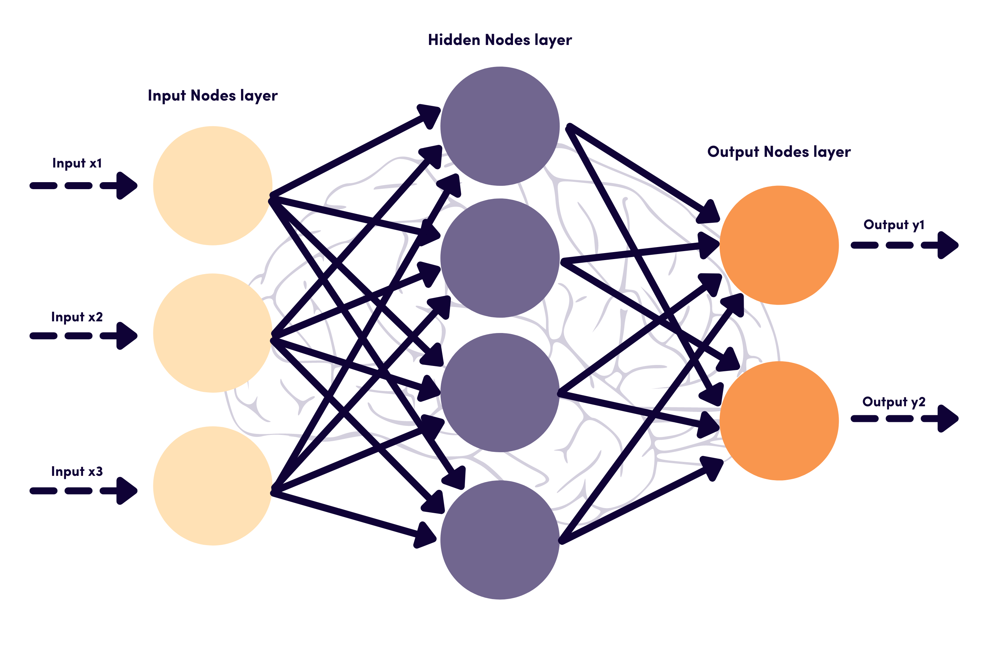
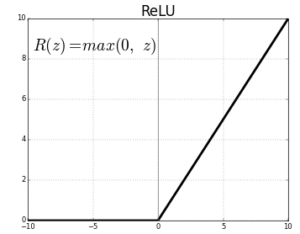
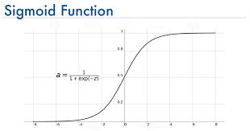
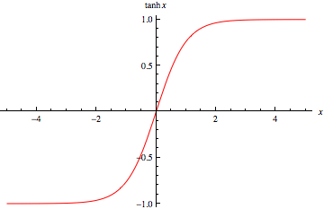
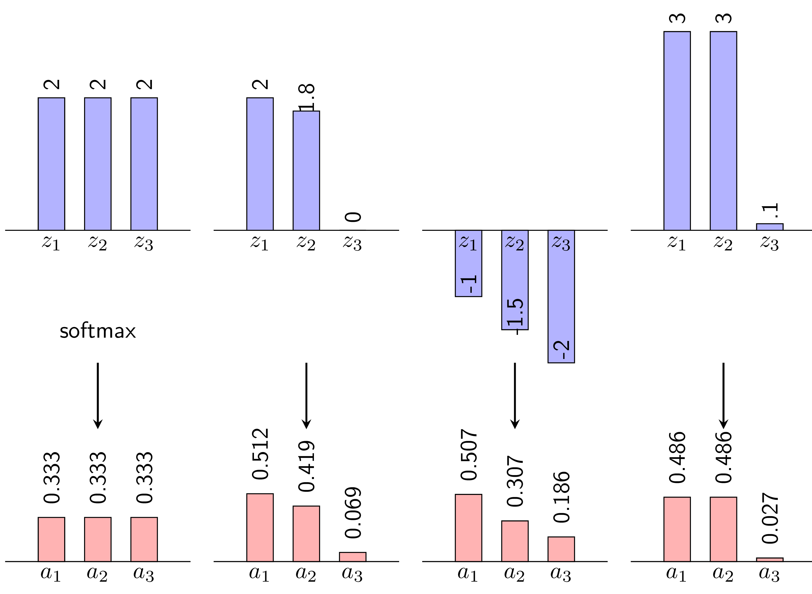
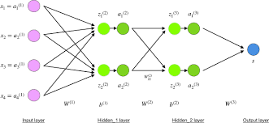
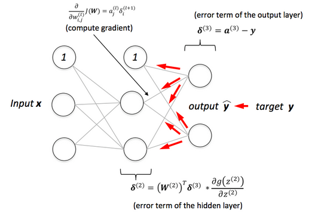

# Multi-Layer Perceptron (MLP)

## Introduction to Artificial Neural Networks (ANN)

Artificial Neural Networks (ANN) are one of the foundational concepts in the fields of artificial intelligence (AI) and machine learning. Inspired by the structure and functioning of the human brain's nervous system, ANNs are computational models capable of learning from data and improving their performance over time. They have become the backbone of many modern technologies, including image recognition, natural language processing, and autonomous vehicles.

---

## Origins of Artificial Neural Networks

The concept of ANN originated from the functioning of biological neurons in the human brain. The first artificial neuron model, known as the "Perceptron," was developed in 1958 by scientist Frank Rosenblatt. Although the initial Perceptron could only solve linear problems, it paved the way for the exploration of more complex models, leading to the development of multi-layer networks and modern deep learning algorithms.

---

## Problem Statement Addressed by ANN

ANNs are commonly applied to problems involving classification, prediction, and pattern recognition. A typical problem that ANNs tackle is image classification: the system learns from labeled images and subsequently predicts the labels of new images. ANNs are also utilized in optimization tasks, regression analysis, and time series forecasting.

---

## Layers in ANN

An Artificial Neural Network consists of multiple layers that work together to process and extract information from data:

1. **Input Layer**: This is the first layer that receives input data. Each neuron in this layer represents a feature of the data.
   
2. **Hidden Layer(s)**: One or more hidden layers lie between the input and output layers. These layers extract features from the data using activation functions like ReLU (Rectified Linear Unit) or Sigmoid.
   
3. **Output Layer**: The final layer produces the predicted results based on the information processed in the hidden layers. The number of neurons in this layer depends on the problem at hand (e.g., if the classification task has three categories, the output layer will contain three neurons).

---

## Activation Functions in ANN

Activation functions play a crucial role in determining the output of neurons in ANN. Here are some common activation functions:

1. **ReLU (Rectified Linear Unit)**: The ReLU function is defined as 

$$
f(x) = \max(0, x)
$$

It is widely used in hidden layers due to its simplicity and effectiveness in mitigating the vanishing gradient problem. ReLU allows positive values to pass through while blocking negative values, leading to faster convergence during training.

2. **Sigmoid**: The Sigmoid function is defined as 
   
$$
f(x) = \frac{1}{1 + e^{-x}}
$$

It squashes input values to a range between 0 and 1, making it suitable for binary classification tasks. However, it can lead to vanishing gradients for large positive or negative inputs, which may hinder the learning process in deeper networks.

1. **Tanh (Hyperbolic Tangent)**: The Tanh function is defined as
   
$$
f(x) = \frac{e^x - e^{-x}}{e^x + e^{-x}}
$$

It outputs values between -1 and 1, which helps in centering the data around zero. Tanh generally performs better than the Sigmoid function, as it mitigates the vanishing gradient problem to a greater extent.

1. **Softmax**: The Softmax function is typically used in the output layer of multi-class classification problems. It converts raw scores (logits) from the network into probabilities that sum to 1, making it suitable for models that need to predict the likelihood of each class. The formula for the Softmax function is given by:
   
$$
f(x_i) = \frac{e^{x_i}}{\sum_{j} e^{x_j}}
$$
   
where $x_i$ is the logit for class `i` and the denominator sums over all classes.

---

## Feed Forward and Backpropagation Processes

### Feed Forward
This is the initial process where the neural network processes input data. The data flows from the input layer through the hidden layers, and each neuron computes its output based on the weights and activation function. The final result is the prediction made by the output layer.

We can represent the feed forward process mathematically as follows:

$$
a^{0} = x
$$

$$
z^{l} = W^{l} a^{l-1} + b^{l}, \quad l = 1, 2, \ldots, L
$$

$$
a^{l} = f(z^{l}), \quad l = 1, 2, \ldots, L
$$

$$
\hat{y} = a^{L}
$$

where:
- $a^l$ is the activation of layer `l`
- $z^{l}$ is the weighted sum of inputs to layer `l`
- $W^{l}$ and $b^{l}$ are the weights and biases of layer `l`
- $f$ is the activation function
- $\hat{y}$ is the predicted output
- $x$ is the input data
- $L$ is the total number of layers in the network
- $l$ is the layer index

### Backpropagation
After obtaining the prediction, the model compares it with the actual value and calculates the error using the loss function. The backpropagation process involves sending the error backward through the network, from the output to the input layers. The weights of the neurons are updated based on the gradients of the loss function, which helps to reduce the error in future training iterations.

#### Stotastic Gradient Descent (SGD)

Stochastic Gradient Descent (SGD) is an optimization technique used to compute the gradients for weight matrices and biases based on a training data pair \((x, y)\). To simplify, let \(J\) represent a loss function associated with this pair, where \(J\) can be any loss function, not limited to Mean Squared Error (MSE).

The derivative of the loss function concerning a specific weight in the final layer can be expressed as:

$$
\frac{\partial J}{\partial w^{L}_{ij}} = \frac{\partial J}{\partial z^{L}_{j}} \cdot \frac{\partial z^{L}_{j}}{\partial w^{L}_{ij}} = e^{L}_{j} \cdot a^{L-1}_{i}
$$

Here, $e^{L}_{j} = \frac{\partial J}{\partial z^{L}_{j}}$ is typically straightforward to calculate, and $\frac{\partial z^{L}_{j}}{\partial w^{L}_{ij}} = a^{L-1}_{i}$, as $z^{L}_{j} = (w^{L}_{j})^{T} a^{L-1} + b^{L}_{j}$.

Similarly, the derivative of the loss function with respect to the bias in the final layer is given by:

$$
\frac{\partial J}{\partial b^{L}_{j}} = \frac{\partial J}{\partial z^{L}_{j}} \cdot \frac{\partial z^{L}_{j}}{\partial b^{L}_{j}} = e^{L}_{j}
$$

To derive gradients for weights in earlier layers, consider the structure shown in the diagram below. Here, each unit's input `z` and output `a` are explicitly labeled for clarity. The gradient can be computed as:

$$
\frac{\partial J}{\partial w^{l}_{ij}} = \frac{\partial J}{\partial z^{l}_{j}} \cdot \frac{\partial z^{l}_{j}}{\partial w^{l}_{ij}} = e^{l}_{j} \cdot a^{l-1}_{i}
$$

with

$$
e^{l}_{j} = \frac{\partial J}{\partial z^{l}_{j}} = \frac{\partial J}{\partial a^{l}_{j}} \cdot \frac{\partial a^{l}_{j}}{\partial z^{l}_{j}} = \left( \sum_{k=1}^{d^{l+1}} \frac{\partial J}{\partial z^{l+1}_{k}} \cdot \frac{\partial z^{l+1}_{k}}{\partial a^{l}_{j}} \right) f' (z^{l}_{j})
$$

The summation in the second equation arises because $a^{l}_{j}$ influences the computation of all $z^{l+1}_{k}$, where $k = 1, 2, \ldots, d^{l+1}$. The derivative outside the parentheses emphasizes that $a^{l}_{j} = f(z^{l}_{j})$. 

From this process, it's clear that calculating $e^{l}_{j}$ is crucial. Moreover, to derive these values, one must compute $e^{l+1}_{j}$ from the output layer back to the input layer. This backward computation gives rise to the term "backpropagation."

In summary, the calculation of derivatives in SGD can be succinctly outlined as follows: 

1. Compute gradients using backpropagation.
2. Update model parameters based on the computed gradients and learning rate.

This approach ensures efficient training of models while handling stochastic updates effectively.

---

Next, we will delve into the concept of backpropagation in more detail, exploring how errors are propagated through the network and how weights are updated to minimize these errors.